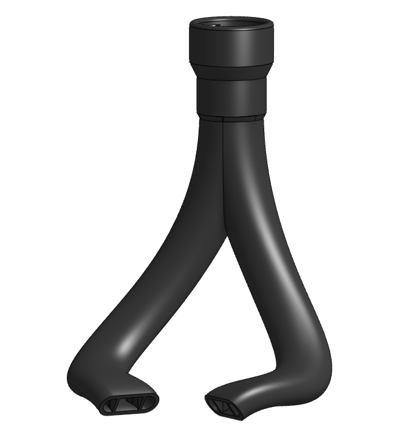

# Ductwork

*(This page provides information on the ducting on Javelin and simulations and testing about it. The connected electronics/probe mounts Javelin will include on the ducts are not the subject of this page.)*

*(Note that the ducts are unfinished, however everything on this page is planned for the ducts)*

## Design Overview

Javelins ducts are meant to be slim and lightweight, with the airflow coming from a CPAP tube setup.

The duct itself begins behind the X beam instead of infront of the toolhead. This is done primarily for center of mass and assembly optimizations and allows easy electronics/beacon based mounts. 

Another difference between other CPAP ducts and Javelin is that rather than having the tube wrap around the intake of the ducting, it fits into a recess as to ensure the airflow path does not suddenly narrow out. It can be held in place with a small zip tie.

Additionally, the ducts serve as the mounting points for the toolhead breakout board and for the beacon or other probes.

Mounting points for the duct include 4 screw holes at the nozzle support on the steel shroud of the hotend, and 2 screw holes behind the extruder stepper motor (brass or aluminum standoffs)

Due to relying on the extruders pancake motor with standoffs as a mounting point, there will be several different configurations for the ducts in the step files folder in the github repository.

Furthermore, due to a select few options for probe mounting (Current ideas are Beacon, standard threaded inductive probe, and Cartographer, maybe BL Touch) the ducts will be further divided into subconfigurations for each probe.

### Printability

The ducts are meant to be easily 3D printable, with only minimal supports needed for somewhat steep overhangs.

As the hotend shroud supports the nozzle and provides structure to the toolhead, there is little extra benefit to SLM ducts, and thus the ducts are only designed and optimized for FDM. My theory is that the structural benefit of all metal ducts would not extend as far as the performance loss of the increased toolhead weight to move around.

## Simulation Results

**Not finished yet, SimScale is being annoying. Should be up soon, before i finalize the rest of the ducts once airflow is roughly ironed out (February 4th, 2026)**

(SimScale simulation download link...)

(SimScale views of particle traces and other relevant info about the simulation)

## Real World Testing

**Unsure of whether I can do this yet, best fan I got is a 12032 and it'd be heavily constricted by narrowing down to a CPAP tube. Might have to wait until I get a job and I start building the printer and the toolhead for this.**

(Video of a water test on the duct...)
